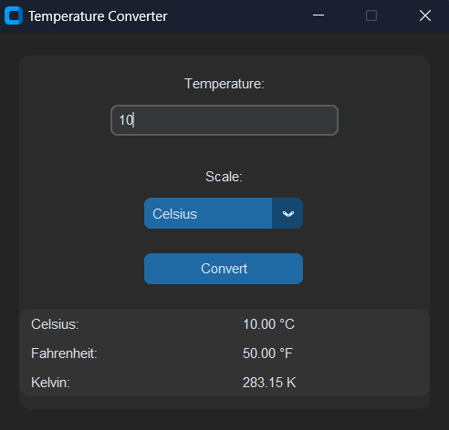

# Temperature converter



## Getting Started

This is a simple temperature converter application built with Python's customtkinter module. It lets users enter a temperature in Celsius, Fahrenheit, or Kelvin and then converts that value to the other two scales. The clean, modern interface starts centered on the screen for an optimal user experience.

## Prerequisites

What things you need to install the software and how to install them:

Firstly, install all the needed modules, for that, you will need to install [python](https://www.python.org/downloads/).

## Installation Instructions

1. #### Clone the repository
   
   ```bash
   git clone https://github.com/Smokez01/Temp-converter
   ```
   
2. #### Install Dependencies:

   ```bash
   pip install -r requirements.txt
   ```

## Usage

If you would like to use this code, personally or commercially, please give me ([Smokez01](https://github.com/Smokez01)) credit.

## Built With

[customtkinter](https://customtkinter.tomschimansky.com/) - The library used

[Python](https://www.python.org/) - The Runtime

## Contributing
Any pull request's are welcome!

## Issues

If you have any issue, please don't hesitate to make a [issue](https://github.com/Smokez01/Temp-converter/issues), I will gladly take a look at it and try to fix it!

## Authors

Smokez01 - Initial work & all the project - [Smokez01](https://github.com/Smokez01)

## License

This project is licensed under the MIT License - see the [LICENSE](https://github.com/Smokez01/IP-Calculator/blob/main/LICENSE) file for details
